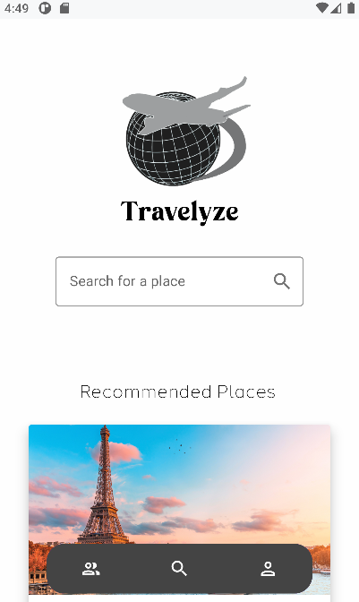
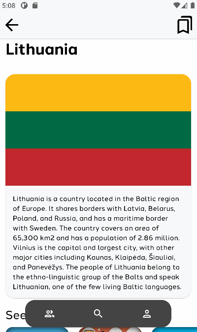
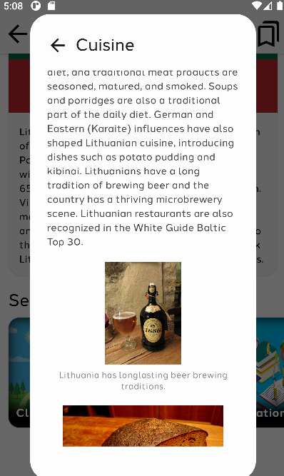
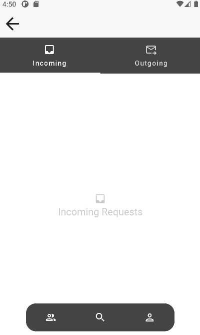
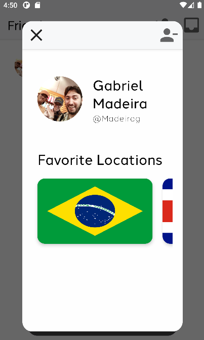
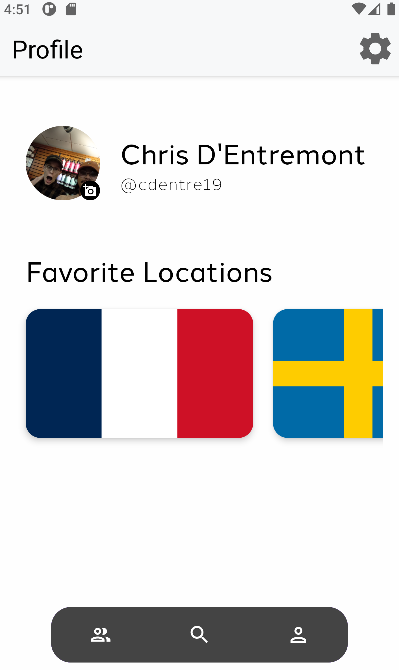
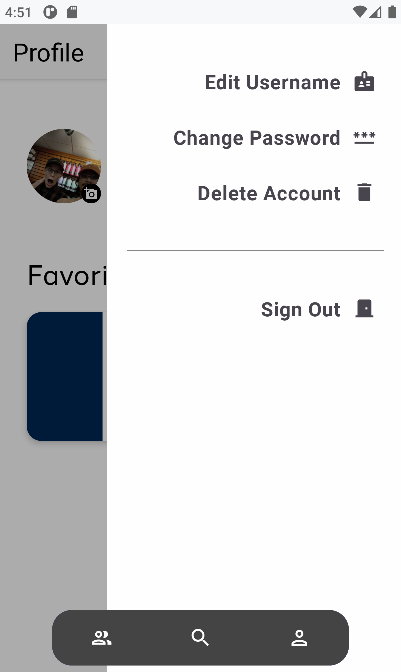

*Please note that there is no public application available for download, and that Travelyze was created as a proof of concept.
The application can be viewed and ran by cloning the repository into Android Studio and emulating a device to run it.*

# Introduction
Travelyze is an Android application created as a capstone project for Wentworth Institute of Technology by Chris D'Entremont and Gabriel Madeira.
Our goal for this capstone project was to create an application that provided two main features: the ability to look up a country by name and
view information about it, and a friend system that would let the user add other users as friends and share favorite countries. 

# Method
Android Studio was used with the Jetpack Compose framework in order to create appealing and user-friendly interfaces for our application.
We implemented a 3-tab system for the application as we felt that this was the most efficient method to display everything in the application.
The 3-tab system included a tab for the friends page where requests could be sent and received, another tab for searching through the country
database (the main page), and a third tab for viewing the user profile and performing various account functions.

Google Firebase was used to perform account functions such as creating an account, deleting an account, and handling user authentication.
It was also used to store user information in order to handle user friend requests.

# Results
We are very pleased with how the application came out in the end. There are many improvements that can be made in the code,
but we feel that in the time that we were given to complete the capstone project, we were able to create a functioning and presentable
application. If given more time, we would want to expand upon the features we created

# Images

